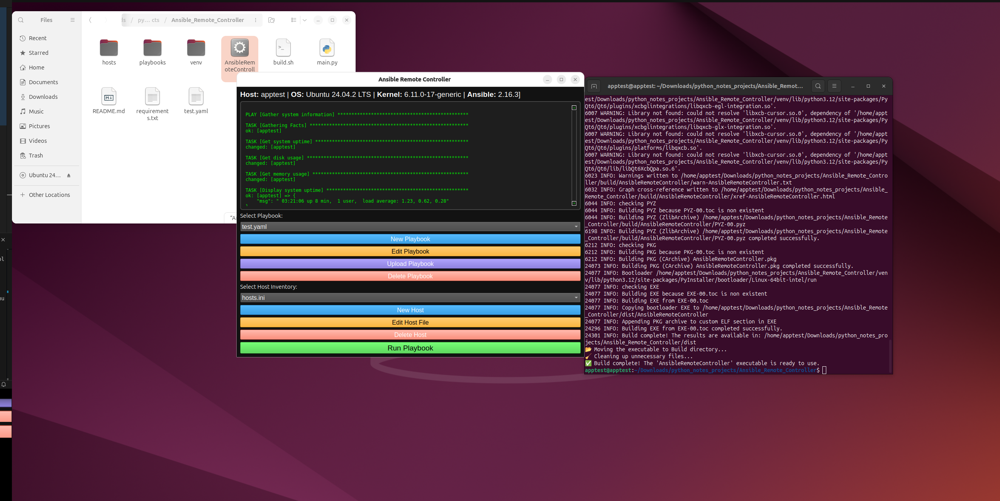

### **Ansible Remote Controller**

A desktop application that allows users to **store, edit, and run Ansible playbooks** with an intuitive **GUI**.

---

## **🚀 Features**

- **Graphical User Interface (GUI)** built with **PyQt6**.
- **Playbook Management**: Create, edit, upload, and delete Ansible playbooks.
- **Inventory Management**: Manage host inventories for playbooks.
- **Run Playbooks**: Execute Ansible playbooks directly from the GUI.
- **Auto-Detect System Info**: Displays **hostname, OS, and kernel** version.
- **Error Handling**: Displays errors if Ansible is missing or commands fail.

---

## **📦 Requirements**

Ensure your system has the following dependencies installed:

- **Python 3.10+**
- **pip** (Python package manager)
- **Virtual environment (********`venv`********\*\*\*\*\*\*\*\*\*\*\*\*\*\*\*\*)**
- **Ansible**

The required Python packages are listed in `requirements.txt`:

```
PyQt6
pyinstaller
PyYAML
ansible
```

---

## **🛠️ Installation & Setup**

### **1️⃣ Clone the Project**

```bash
git clone https://github.com/sohaib1khan/Ansible_Remote_Controller.git
cd Ansible_Remote_Controller
```

### **2️⃣ Run the Build Script**

To install dependencies and build the application, run:

```bash
bash build.sh
```

This script will:
✔️ Install **Python dependencies**\
✔️ Create a **virtual environment**\
✔️ Install **Ansible** (if missing)\
✔️ Compile the project into an executable using **PyInstaller**

---

## **🚀 Running the Application**

After building, launch the application using:

```bash
./AnsibleRemoteController
```

or run it directly from Python:

```bash
python main.py
```

---

## **📂 Project Structure**

```
📂 Ansible_Remote_Controller
 ├── build.sh            # Setup & build script
 ├── main.py             # Application source code
 ├── requirements.txt    # Required Python dependencies
```

---

## **🐛 Troubleshooting**

### **1️⃣ "No such file or directory: 'ansible-playbook'"**

Ensure Ansible is installed and available:

```bash
ansible --version
```

If missing, install it:

```bash
sudo apt install ansible -y  # Debian/Ubuntu
sudo dnf install ansible -y  # Fedora
```

### **2️⃣ "ModuleNotFoundError: No module named 'yaml'"**

Run the following to install missing dependencies:

```bash
pip install -r requirements.txt
```

---

## **Demo**


