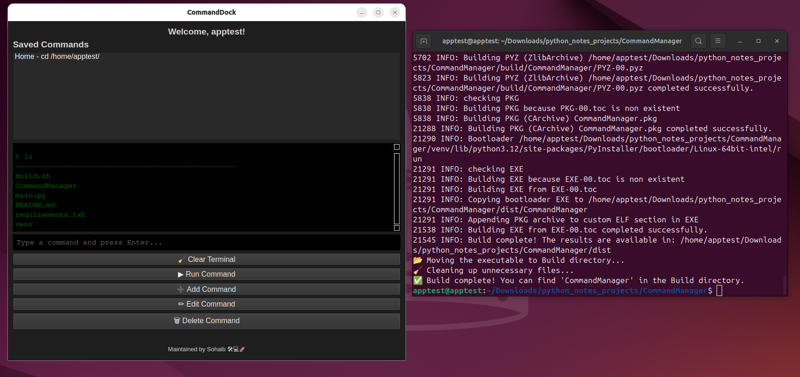

# 🚀 CommandManager

CommandManager is a **lightweight yet powerful command execution tool** designed to make managing and running system commands seamless. With built-in **autocomplete**, a **dark mode UI**, and the ability to **store custom commands**, it serves as an efficient alternative to the traditional terminal.

## 🎯 Features

- **Command Autocomplete**: Suggests system and user-defined commands.
- **Dark Mode UI**: Eye-friendly interface optimized for long usage.
- **Interactive Command Management**: Add, edit, and delete saved commands.
- **Live Terminal Output**: Run commands and see real-time results.
- **Portable Build**: Easily package as a standalone executable using `PyInstaller`.
- **Multi-OS Support**: Works on Ubuntu, Debian, Fedora, and RHEL-based systems.

---

## 🛠 Installation & Usage

### 🔍 Requirements

Before installing, ensure you have the following dependencies:

- **Python 3**
- **Pip**
- **Virtual Environment (venv)**
- **PyInstaller**
- **PyQt6** (for GUI rendering)

If missing, the script will prompt you to install them.

---

### 📦 Installation (Automatic)

To get started, simply run the **build script**:

```bash
bash build.sh
```

The script provides two options:

1️⃣ **Dry Run**: Checks if all requirements are met, but does not install anything.\
2️⃣ **Direct Install & Build**: Installs missing dependencies and compiles the application.

---

### 🖥️ Running the Application

Once built, run the executable from the **Build** directory:

```bash
./CommandManager
```

If running from source, activate the virtual environment and execute:

```bash
source venv/bin/activate
python main.py
```

---

## ⚡ Features in Detail

### 🔥 Smart Autocomplete

CommandManager dynamically loads both **system commands** and **user-defined commands**, giving you a fast and efficient way to execute commands.

### 🎨 Beautiful Dark UI

- **Header:** Greets you with your hostname.
- **Command List:** Displays saved commands for easy access.
- **Output Box:** Shows real-time terminal execution results.
- **Footer:** Displays maintainer information.

### 📜 Managing Commands

- **Add New Commands**: Click the **➕ Add Command** button to store frequently used commands.
- **Edit Commands**: Modify stored commands effortlessly.
- **Delete Commands**: Remove unwanted commands from your list.
- **Run Commands**: Select a command and hit **▶️ Run Command**.

### 🚀 Execution & Output

The terminal-style output box logs every executed command, displaying results just like a real terminal. However, **directory changes (****`cd`****) are not yet supported**.

---

## 🛠 Development & Contribution

We love contributions! If you want to improve CommandManager, follow these steps:

1. **Clone the repo**:

   ```bash
   git clone https://github.com/sohaib1khan/python_notes_projects
   ```

2. **Create a virtual environment**:

   ```bash
   python3 -m venv venv
   source venv/bin/activate
   ```

3. **Install dependencies**:

   ```bash
   pip install -r requirements.txt
   ```

4. **Run the application**:

   ```bash
   python main.py
   ```

---

## 🎉 Future Enhancements

🔹 Full Terminal Emulation (Support for `cd` and interactive sessions)\
🔹 Theming Options (Custom color schemes)\
🔹 Multi-Platform Support (Windows/macOS Compatibility)\
🔹 Command Execution History & Logging

---

## **Demo**


