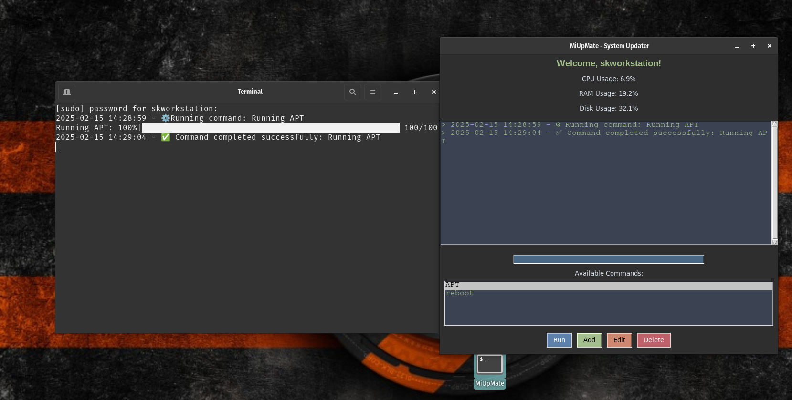

# MiUpMate - System Updater

MiUpMate is a graphical system update manager that allows users to manage and execute system updates and package management commands across different Linux distributions. It supports executing custom commands and tracking system performance metrics such as CPU, RAM, and Disk usage.

---

## Features

- Run system updates and package management commands with a user-friendly GUI
- Monitor system performance (CPU, RAM, Disk usage)
- Add, edit, and delete custom update commands
- Log all executed commands and system updates


---

## Requirements

Ensure you have the required dependencies installed before running or building MiUpMate.

### Installation of dependencies

You can install the required dependencies by running:

```sh
pip install -r requirements.txt
```

### **requirements.txt**

```
os
subprocess
shutil
datetime
psutil
tkinter
tqdm
json
threading
```

---

## How to Build the Application

To create an executable version of MiUpMate using **PyInstaller**, follow these steps:

1. Install PyInstaller if not already installed:

   ```sh
   pip install pyinstaller
   ```

2. Run the following command to package MiUpMate as a standalone executable:

   ```sh
   pyinstaller --onefile --noconsole --name "MiUpMate" gui_buntu_update.py
   ```

   - The `--onefile` flag ensures a single executable file is created.
   - The `--noconsole` flag prevents the terminal from opening when the app runs.

3. After the build process, the executable will be available in the `dist/` directory.

---

## Running the Application

After building the application, you can run it as follows:

### Running from the `dist/` directory

```sh
cd dist
sudo ./MiUpMate
```

### Running from the source code

If you prefer to run the script directly, use:

```sh
sudo python3 gui_buntu_update.py
```

---

## Creating a Desktop Launcher (Optional)

To integrate MiUpMate into your desktop environment with an application launcher, create a `.desktop` file:

### **1. Create the desktop file**

```sh
touch ~/.local/share/applications/MiUpMate.desktop
```

### **2. Edit the file and add the following content:**

```ini
[Desktop Entry]
Version=1.0
Type=Application
Name=MiUpMate
Comment=Run MiUpMate Script
Exec=gnome-terminal -- bash -c "sudo /PATH/TO/dist/MiUpMate; exec bash"
Icon=utilities-terminal
Terminal=true
Categories=Utility;

```

Replace `/PATH/TO` with your actual path.

### **3. Make the file executable:**

```sh
chmod +x ~/.local/share/applications/MiUpMate.desktop
```

Now, you should see MiUpMate in your application menu.

---

## Troubleshooting

If you encounter permission issues while running the app from the desktop launcher, ensure your system allows `pkexec` or use the `sudo` method for running the app.

```sh
sudo /path/to/MiUpMate
```

If the GUI does not appear, ensure that Tkinter is installed:

```sh
sudo apt install python3-tk  # For Debian/Ubuntu-based distros
```

---


## **Demo**




